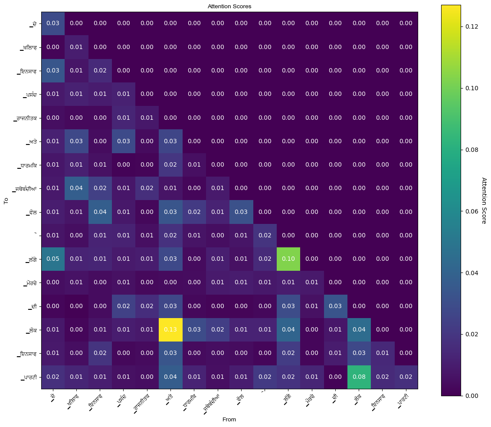

# MiniPunjabiLLM
### Description: 
In this repository I am trying to train my own LLM (actually MLM i.e. mini langugae model) from scratch, I have trained a langugae models for next character prediction and next token prediction for Punjabi and English Langugaes. 
### Goal:
- To better understand and fill gaps in my knowledge about the decoder only transformer architecture by implemeting it in Pytorch.
- To have a better understanding of langugae models in general.
- Perform experiments with LLMs:
  1. so far I have implemented RoPE embeddings.
  2. multi-character prediction based in Meta's multi-token prediction paper.
  3. Visulaised attention scores: 
